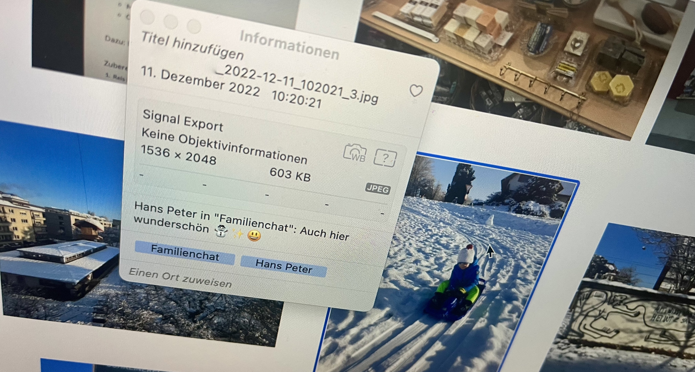

~~~~
                            , _
 () o  _,        _,  |\    /|/_)o |\  _|   _          _   ,_ _|_
 /\ | / | /|/|  / |  |/     |  \| |/ / |  |/ /\/ |/\_/ \_/  | |
/(_)|/\/|/ | |_/\/|_/|_/    |(_/|/|_/\/|_/|_/ /\/|_/ \_/    |/|_/
       (|                                       (|
~~~~

## Why «Signal Bildexport» had to be done

Ever wanted to save images from **Signal** messages? It is a chore:

- Every **single photo** needs to be **exported separately**
- All metadata is lost – and even with a **wrong Timestamp**. This messes up your (iCloud) photo timeline!

Unlike Whatsapp, Signal does not provide automatic saving of received images to the camera roll. The discussion is still going on:

- Github Feature Request #1567: [Option to auto-save received images/video to camera roll](https://github.com/signalapp/Signal-iOS/issues/1567)
- Signal Community Discussion Thread: [Automatically save attachments to device](https://community.signalusers.org/t/automatically-save-attachments-to-device-and-possibly-link-to-them-from-inside-the-app/5147)

Due to this hassle, friends and family were **threatening to switch back** from **Signal** to **Whatsapp**. Things were getting serious! But, fear not:

## What «Signal Bildexport» does

Since the images cannot be saved directly from Android/iOS, this script **exports photos from** **Signal Desktop** on Mac or Windows to a chosen **folder** or **iCloud Photos**

1. Reads Signal Desktop's encrypted sqlite database
2. Collects all messages which were received (since Signal Desktop was installed)
3. Exports every found JPEG Photo to the *iCloud Photos* folder (Windows) or the *Photos* App (Mac) with the following metadata annotations:
   - Timestamp (the closed we can get: the instant when the picture was sent)
   - Who send it (Full contact name or Signal Name, if not in contacts)
   - Name of the Chat group
   - The message that came with it as the image's title

## Usage

~~~~bash
cd signal-bildexport/
python export.py
~~~~

On the first run, `config.yaml` will be created. The defaults should be fine, but it allows you to restrict which photos should be exported:

~~~~yaml
import_photos_from_messages:
  any_with_my_reaction: ['🤩'] # only export images for which your reaction was 🤩
  in_conversation:
    exclude: [] # Add conversations from which you don't want to import anyting (work?)
    include:
    - '*' # feel free to move the '*' to 'exclude' and specify only the desired chats here
last_run: 0 # epoch timestamp of last run. Set to 0 to trigger a full export
output_path: images # output path for the images (different for Mac and Windows)
x-advanced:
  pre_copy: false
  pre_decrypt: false
  signal_path: /Users/matthiasroggo/Library/Application Support/Signal
  sqlcipher_bin: ./sqlcipher/bin/sqlcipher # Only required if pre_decrypt = True (Windows)

~~~~

Installation on Windows using WSL
-------

#### Prerequisites

- iCloud for Windows is installed
- Signal Desktop is installed and configured (and some Photos have been received already)

#### Powershell

~~~~powershell
wsl --install
~~~~

#### Bash

~~~~bash
# Install pip
sudo apt-get update  
apt-get install python3-pip  

# Clone repo
git clone https://github.com/bskp/signal-bildexport.git
cd signal-bildexport/

# Build sqlcipher
sudo apt install libsqlite3-dev tclsh libssl-dev
git clone https://github.com/sqlcipher/sqlcipher.git
cd sqlcipher/
./configure --enable-tempstore=yes CFLAGS="-DSQLITE_HAS_CODEC" LDFLAGS="-lcrypto -lsqlite3"
make

# Install required python modules
cd ..
pip install -r requirements.txt
~~~~

## Installation on Mac

#### Prerequisites

- Signal Desktop is installed and configured (and some Photos have been received already)
- [Homebrew](https://brew.sh) is installed

#### Terminal (zsh or bash)

~~~~bash
# Clone repo
git clone https://github.com/bskp/signal-bildexport.git
cd signal-bildexport/

# Install sqlcipher
brew install sqlcipher

# Install required python modules
pip install -r requirements.txt
pip install pysqlcipher3
~~~~

Known Issues
-----

- [ ] Mac: Launching Photos.app with the exported images as parameters fails sometimes and imports nothing. Drag-and-dropping the images on the app icon, however, will work as an easy fix for now

Thanks
----

While getting `pysqlcipher3` to work was a walk in the park on Mac, it almost got me quitting on Windows. Big thanks to [Chris Arderne](https://github.com/carderne) for his fantastic write-up on solving this for [signal-export](https://github.com/carderne/signal-export), where the pre-decrypt approach is taken from!
